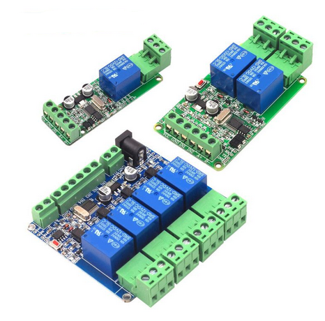

# modbus-rs485-relay
how to control cheap modbus relay using python minimalmodbus




example:

```python
import minimalmodbus
import serial

instrument = minimalmodbus.Instrument('com25',  1, debug = True)
instrument.serial.bytesize = 8
instrument.serial.baudrate = 9600
instrument.serial.stopbits = 1
instrument.serial.parity = serial.PARITY_NONE
instrument.serial.timeout = 1

instrument.write_bit(0, False)
instrument.write_bit(1, True)
```
